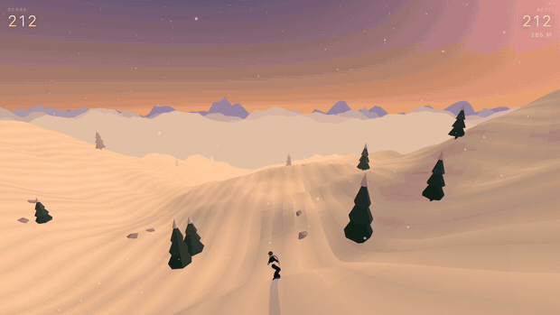

<div align="center">


### An endless snowboarding game that lives in a single HTML file.

Carve an infinite mountain that generates itself as you go. Link tricks off rocks, trees and downed logs. Ride from dawn through to a moonlit night, and try not to hit anything.

**[▶ &nbsp;PLAY IN YOUR BROWSER](https://inkxel.github.io/all-down-hill/)**

<sub>No install · No accounts · Works on desktop and phone</sub>

<br>



</div>

---

## How to play

|  | Desktop | Phone |
|---|---|---|
| **Carve** | `A` `D` or `←` `→` | Tilt the device |
| **Jump** | `SPACE` | Tap anywhere |
| **Spin** | Hold after take-off, release to land it | Hold after take-off |

**The jump is all about timing.** There's no charge meter — press at the lip of a roller and your own momentum throws you. Flat ground barely gets you off the snow.

**Hold to spin, release to land.** Let go and the board eases round to the nearest full rotation, so a half-committed flip straightens out instead of burying you. Hold it all the way into the snow and you'll pay for it.

**Chain tricks together.** Land on a rock and you bounce instead of crashing. Clip the top of a pine and it springs you higher. Jump onto a downed log and you'll grind it — but bail before the end or you're going down. Every one of those links a chain, and the chain banks into your multiplier when you finally touch snow clean.

Wipe out and you get three continues. After that the run's over and it goes on the board — which you can save as an image.

## What's in it

- **An infinite mountain**, built from layered noise and recycled ahead of you as you ride. It never repeats and it never ends.
- **A full day/night cycle** over four minutes — dawn, hard daylight, golden hour, dusk, then stars and a moon.
- **Weather that runs on its own clock**: clear, flurries, heavy snowfall that closes in the fog, and wind that blows it sideways.
- **A paced mountain** rather than random scatter — thread the trees, get a straightaway to breathe, then something to play with.
- **Carve trails** that cut into the snow behind you and slowly fade.
- **Sound built from scratch** — filtered noise for wind and the board's edge, synthesised whumps for landings.

<div align="center">
 
 
</div>

## Made from nothing

There are no assets. Not one image, model, or sound file — every mountain, tree, rock, colour and noise you see and hear is generated by the code at the moment you load the page.

The whole game is one `index.html`. Three.js comes from a CDN; everything else is in that file. No build step, no bundler, no dependencies to install. Clone it and open it, or just [play it](https://inkxel.github.io/all-down-hill/).

```
git clone https://github.com/inkxel/all-down-hill.git
cd all-down-hill && python3 -m http.server
```

## Under the hood

Curious how it works, or why it's shaped this way? The [`knowledge/`](knowledge/AGENTS.md) folder has the whole build: decision records, session-by-session history, and a wiki covering the [terrain](knowledge/wiki/terrain.md), [physics](knowledge/wiki/physics.md), [rider rig](knowledge/wiki/rider.md), [sky and weather](knowledge/wiki/atmosphere.md), and [mobile input](knowledge/wiki/mobile.md).

Start with [`knowledge/wiki/index-map.md`](knowledge/wiki/index-map.md) if you want to find your way around the source.

---

<div align="center">
<sub>Built by <a href="https://tvcker.com">Tucker</a> · MIT</sub>
</div>
