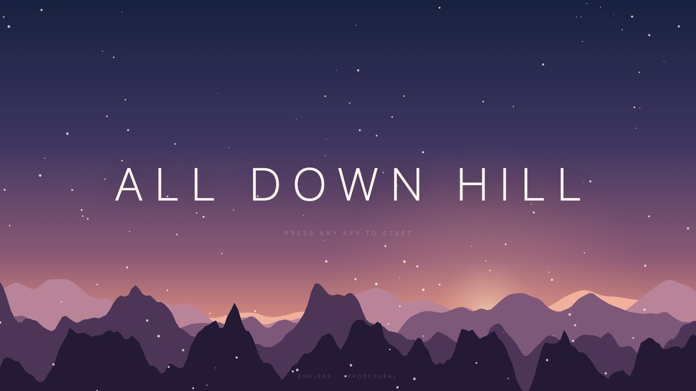
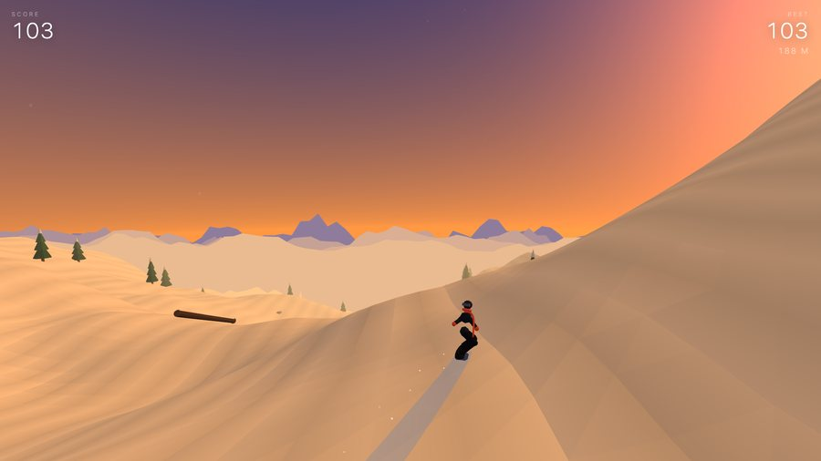
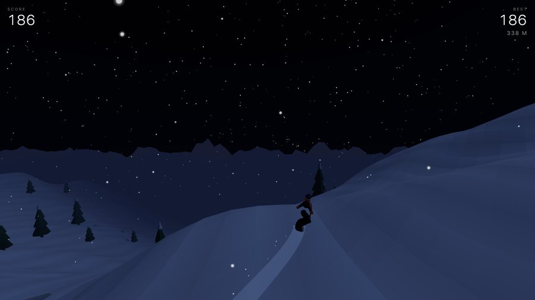
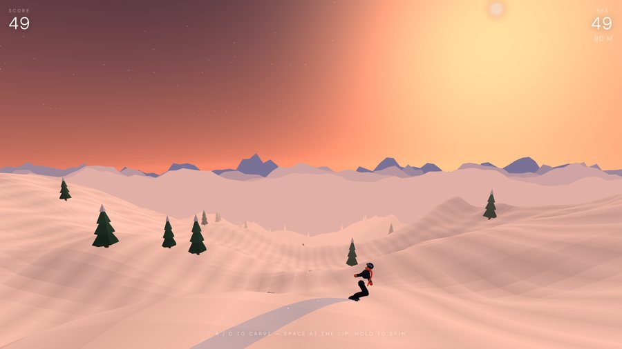
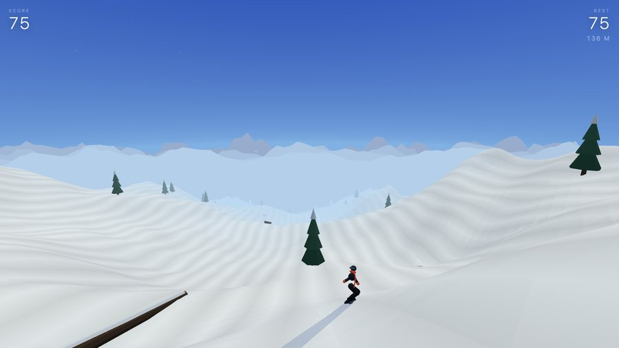

<div align="center">



# There is no lift back up.

You dropped in after last chair. The cats have gone in, the corduroy is setting up hard, and the light is going fast. Nobody is coming to sweep the mountain.

Point it down the fall line and see how long you last.

**[▶ &nbsp;DROP IN](https://inkxel.github.io/all-down-hill/)**

<sub>Browser · No install · Desktop and phone</sub>

</div>

---

## The run

The mountain builds itself a few hundred metres ahead of you and forgets everything behind. It has never been ridden before and it won't exist again.

You get four minutes of daylight. Dawn comes up pink, burns off to hard midday glare, drops into gold, then dusk, then you're riding by moonlight with the fog closed in around you. Weather runs on its own clock and doesn't care what the sky is doing — flurries, a whiteout that pulls the horizon in to nothing, wind that blows the snow sideways past your edge.

Everything on that mountain is a takeoff if you read it right. A rock is a launch. The crown of a pine will kick you higher than the jump you meant to take. A downed log is a rail if you can get onto it clean. String them together without touching snow and they stack — and it all cashes in the moment you stomp the landing.

Hit anything wrong and you're picking yourself out of the snow with three ways back on.

## Riding it

|  | Desktop | Phone |
|---|---|---|
| **Carve** | `A` `D` or `←` `→` | Tilt |
| **Pop** | `SPACE` | Tap |
| **Spin** | Hold, release to set up for the landing | Hold |
| **Pause** | `ENTER` | Two fingers |

**Timing beats mashing.** There's no charge meter. Pop off the lip of a roller and your own speed throws you; pop on the flats and you'll barely clear the snow. The mountain decides how much air you get — you decide when.

**Let go early.** Hold to spin, release and the board eases round to the nearest full rotation, so a half-committed flip straightens itself out. Hold it all the way into the snow and you'll wear it.

**Bail off the log before it runs out.** Riding off the end drops you back to the snow. Popping off the end is worth twice as much.

<div align="center">
 
 
<br><sub>One run, four minutes apart</sub>
</div>

## Nothing here was drawn

There are no assets in this repository. Not one image, model, texture or sound file.

Every ridge on the horizon, every pine, every rock, the colour of the sky at any minute of the cycle, the wind in your ears, the edge chattering through a hard carve, the synth line that speeds up as you do — all of it is written into being by the code at the moment the page loads. Delete your cache and it builds the whole mountain again from nothing.

It is one `index.html`. Three.js from a CDN, and then the file. No build step, nothing to install.

```
git clone https://github.com/inkxel/all-down-hill.git
cd all-down-hill && python3 -m http.server
```

---

<div align="center">
<sub>Built by <a href="https://tvcker.com">Tucker</a> · MIT</sub>
</div>
